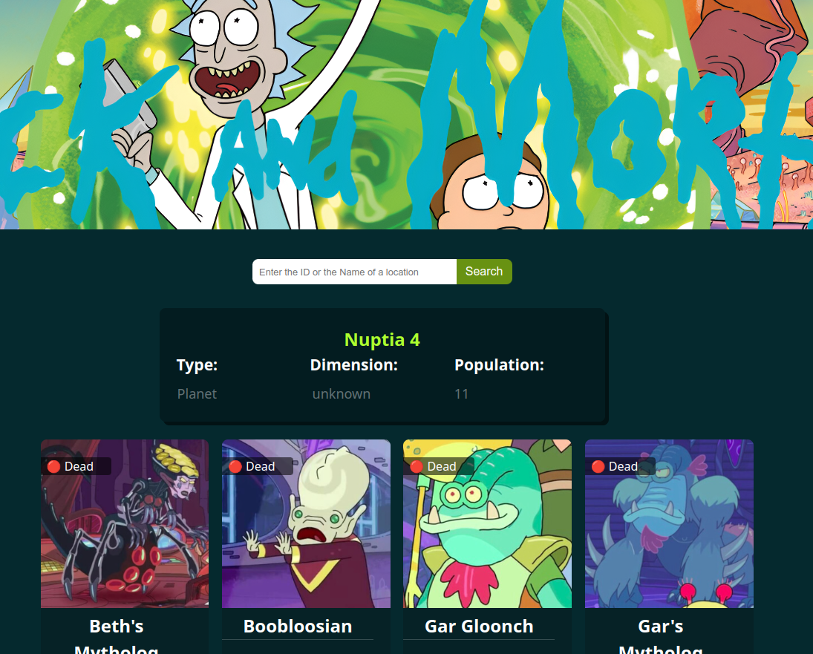

# Buscador de Personajes de Rick y Morty

## ¡Descubre a tus personajes favoritos de Rick y Morty!

Esta aplicación web, construida con ReactJS y Vite, te permite buscar personajes de la popular serie de animación Rick y Morty utilizando su ID. Primero encontraras la locacion con sus personajes luego podras encontrar un listado de personajes de ese lugar, se muestran detalles como nombre, estado y otras informaciones relevantes.

## Caracteristicas

- **Búsqueda por ID:** : Introduce el ID de una locacion para obtener información detallada.

- **Datos completos:** : Muestra nombre, estado y otros datos relevantes del personaje y la locacion.

- **Interfaz intuitiva:** Diseño moderno y fácil de usar, optimizado para diferentes dispositivos.

- **Componentes reutilizables:** : Estructura modular del código para facilitar el mantenimiento.

- **Hooks:** Utiliza los hooks useState, useEffect, useRef, y Custom hook personalizado para la conexión a la rest api y paginacion. 

- **CSS:**  Estiliza la aplicación. 

- **ReactJS:**  Framework JavaScript para crear interfaces de usuario. 

- **Vite:**  Herramienta de construcción de frontend rápida y basada en ES modules. 

- **Lucide Icons:** : Iconos personalizados para mejorar la interfaz.
 
Puedes visitar la plataforma en línea en [https://s03e03-rm-fmg.vercel.app/](https://s03e03-rm-fmg.vercel.app/)

## Requisitos del Sistema

- **Sistema Operativo:** Ubuntu 22.04.4 LTS o Windows 10 Pro 1803 

- **NodeJS:** Versión 18.20.4 o superior 

- **npm/npx:** Versión 10.8.4 o superior 

- **Vite::** version 5.4 o superior 

- **ReactJs:** vesion 18.3 o superior 
    
## Sistemas Alternativos Probados

El proyecto también ha sido probado en el siguiente entorno alternativo:

- **Sistema Operativo:** Windows 10 Pro 1803

- **NodeJS:** NodeJS: 18.20.4

- **npm/npx:** Versión 10.8.4 o superior 

- **Vite:** version 5.4 o superior 

- **ReactJs:** vesion 18.3 o superior 

## Contribuciones
Las contribuciones son bienvenidas. Si encuentras algún error o deseas agregar nuevas funcionalidades, no dudes en abrir un issue, una pull  request, o fork en el repositorio.

## Imagenes

Pantalla principal 

## Comandos Útiles

Ver información del sistema:

uname -r

sb_release -a

node -v

npm -v

## Instalación

estructura del proyecto

## Estructura del proyecto

 ## Instalación

Estrcutura del proyecto
```
index.html
readme.md
└── src/
    ├── App.jsx
    ├── App.css
    ├── index.css
    ├── components/
    │   ├── ResidentCard.jsx
    │   ├── ResidentsList.jsx
    │   └── Search.jsx
    │   └── SumaryCard.jsx
    ├── hooks/
    │   ├── useFetch.jsx
    │   └── usePagination.jsx
    └──  assets/
        └── img/
           └── header.png

```

Para instalar bajar el proyecto del repositorio:

git clone https://github.com/fabinnerself/s03e03-rm-fmg.git

luego correr:

cd  s03e03-rm-fmg

npm install

npm i axios

npm run dev

(C) 2024 Favian Medina Gemio